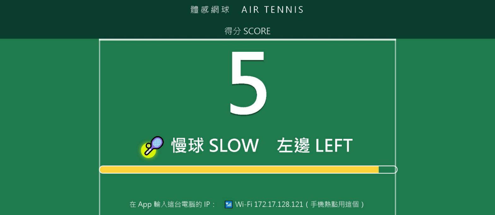

# 空氣網球 Air Tennis

把手機當球拍揮，手機會發出擊球聲、震動，並用語音告訴你球來了。
用 MIT App Inventor 製作，是崑山科技大學資訊工程系「行動程式設計」課程的延伸範例。

Swing your phone like a racket. Built with MIT App Inventor.

## 玩法

1. 握緊手機，像揮球拍一樣揮。
2. 按最上面的按鈕切換模式：
   - **自由揮拍**：每揮一下響一聲，畫面顯示揮拍次數。
   - **對打**：揮拍發球。一到兩秒後對手回擊，你會聽到球聲、感到震動，並聽到語音說「快球，左邊」或「慢球，右邊」。
     快球要在 1.8 秒內揮到，慢球 3 秒內，揮到得 1 分。
3. 來不及揮到，語音會說「你 miss 了，遊戲結束」。
4. 不想打了就按「✋ 不打了」。
5. 揮得太急，手機會提醒「慢一點，等球過來再打」。

## 兩個版本

| 版本 | 檔案 | 適合 |
|------|------|------|
| 第 3 版 | `Air_Tennis_v3c.aia` | 只用一支手機玩，也適合拿來學積木怎麼寫 |
| 第 4 版 | `Air_Tennis_v4c.aia` | 多一個電腦大螢幕，旁邊的人可以一起看比賽 |

兩版的玩法相同。第 4 版不填電腦 IP 時，就和第 3 版一樣可以單機玩。

## 安裝

到 [Releases](../../releases) 下載 `.apk`，傳到 Android 手機安裝。

想看或修改積木：到 <https://ai2.appinventor.mit.edu>，選「專案 → 匯入專案 (.aia)」，上傳本頁的 `.aia` 檔。

## 第 4 版：接上電腦大螢幕

需要一台 Windows 電腦，手機和電腦要在同一個網路（最簡單的做法：手機開熱點，電腦連上去）。

1. 在電腦執行大螢幕程式，兩種方式擇一：
   - 到 [Releases](../../releases) 下載 `tennis_screen.exe`，雙擊執行，再用瀏覽器開 <http://localhost:8000>。
   - 電腦有裝 Python 3 的話，雙擊 `screen/start_screen.bat`，瀏覽器會自動開啟。
2. 第一次執行時 Windows 防火牆會詢問，請按「允許」。
3. 瀏覽器畫面最下方會顯示這台電腦的 IP。有 📶 記號的是無線網卡，手機熱點請用這一個。
4. 在手機 App 最下方輸入這個 IP，按「連線電腦螢幕」。電腦畫面出現「手機已連線」就成功了。
5. 瀏覽器按 F11 可以全螢幕。

球聲和語音是從手機發出的，電腦不會出聲。

## 檔案說明

| 檔案 | 內容 |
|------|------|
| `Air_Tennis_v3c.aia` | 第 3 版 App Inventor 專案 |
| `Air_Tennis_v4c.aia` | 第 4 版 App Inventor 專案 |
| `screen/tennis_screen.py` | 電腦大螢幕程式（Python，不需要安裝其他套件） |
| `screen/start_screen.bat` | 啟動大螢幕並開啟瀏覽器 |

## 使用到的元件

加速度感測器（判斷揮拍）、音效、計時器、文字語音轉換器；第 4 版另外用到網路元件和微型資料庫。
擊球聲是用程式合成的，沒有使用外部音效檔。

## 授權 License

[MIT License](LICENSE)：可以自由使用、修改、散布，保留著作權聲明即可。
